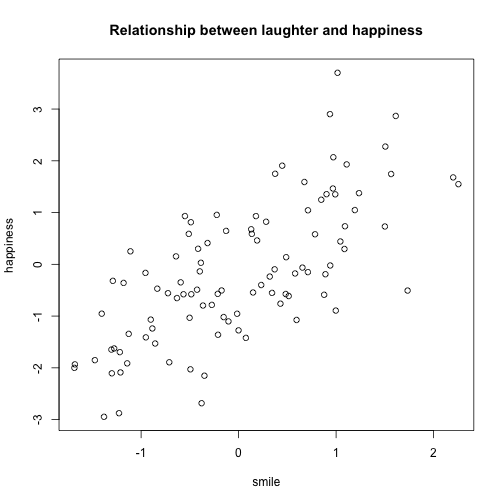

Reproducible Pitch Presentation
========================================================
author: Kris Tan
date: 09 August 2018

Executive Summary
========================================================

This application is developed using R Programming 
language in R Studio's IDE. The application
used shiny environment under R studio for interface
desigening.
This is a fairly good app that can be used to 
get some good suggestions about music and movies.

The application can help for these decisions:

- Recommending music according to mood
- Recommending movie according to genre


Instructions
========================================================

While inputting the mood and genre always keep caps-off

Below is the list of moods you can insert:

- danceable
- happy
- energetic
- in love
- sad

========================================================
 
Below is the list of movie genre you can insert:

- action
- animation
- comedy
- horror
- musicals
- sci-fi
- thriller
- romance


Slide With Code
========================================================

```r
x <- rnorm(100) 
y <- x + rnorm(100)
plot(x,y,xlab="smile", ylab="happiness", main="Relationship between laughter and happiness" )
```




